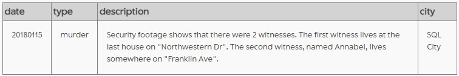
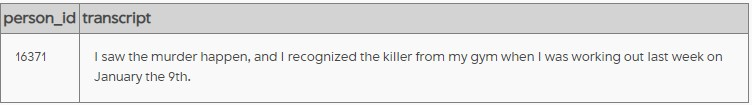
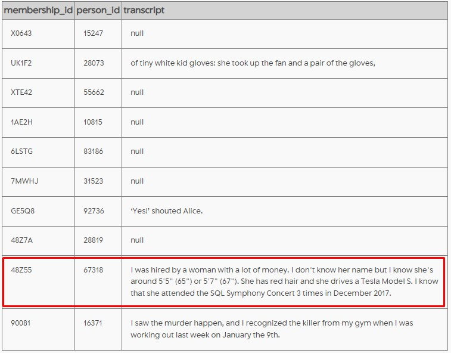
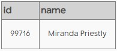
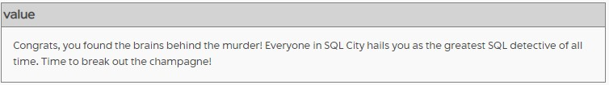

# SQL-Murder-Mystery-Solved-

## Introduction
I am [Zhong Yan](https://www.linkedin.com/in/zhong-yan-tan/), a year 1 student from SMU Information Systems. While preparing for my exam, I came across [SQL Murder Mystery](https://mystery.knightlab.com/), an SQL game to learn SQL basics. To demonstrate what I have learnt, I decided to document the process of my solution step by step. Open to feedback and criticism as I am still new. Enjoy!

## Problem
A crime has taken place and the detective needs your help. The detective gave you the crime scene report, but you somehow lost it. You vaguely remember that the crime was a ​murder​ that occurred sometime on ​Jan.15, 2018​ and that it took place in ​SQL City​. Start by retrieving the corresponding crime scene report from the police department’s database.

## Solution
### Getting description of the crime_scene in detail
Based on the problem statement, we had three informations:
1. date = '20180115'
2. city = 'SQL city'
3. type = 'murder'

**Query**

`select *
from crime_scene_report
where date = '20180115' and city = 'SQL City' and type='murder';`

**output**

### Find interview records where name contains annabel and address_street_name is 'Franklin Ave'
Based on the previous output, we have two information:
1. name like '%annabel%'
2. address_street_name = 'Franklin Ave'

**Query**

`select *
from interview
where person_id in (select id
from person
where name like '%annabel%' and address_street_name = 'Franklin Ave');`

**output**

### Select all membership_id and their respective person_id where check_in_date is '20180109' from the Gym's check in table. If there are interview transcripts, include them. If not, show null
**Query**

`select temp.membership_id, temp.person_id, i.transcript
from (select membership_id, person_id
from get_fit_now_check_in ci, get_fit_now_member m
where ci.membership_id = m.id and check_in_date = '20180109') as temp left join interview i
on temp.person_id = i.person_id;`

**output**

### Caught the hitman, search for person_id that matches the descriptions given by him.
Based on the previous output, we have four information we can search in drivers_license table:
1. Height between 65 and 67
2. hair = 'red'
3. car_make = 'Tesla'
4. car_model = 'Model S'

**Subquery 1**

`select p.id,p.name
from person p, drivers_license d
where p.license_id = d.id and hair_color = 'red' 
and car_make = 'Tesla' and car_model = 'Model S' 
and height between 65 and 67;`

Additionally, we have two information from facebook_event_checkin table:
1. count(*) = 3
2. date like '201712%';

**Subquery 2**

`select person_id from facebook_event_checkin
where date like '201712%' 
group by person_id 
having count(*) =3;`

Now, we merge the query to retrieve the suspects.
**Mereged Query**

`select t1.id, t1.name
from (select p.id,p.name
from person p, drivers_license d
where p.license_id = d.id and hair_color = 'red' 
and car_make = 'Tesla' and car_model = 'Model S' and height between 65 and 67) as t1, (select person_id from facebook_event_checkin
where date like '201712%' group by person_id having count(*) >=3) as t2
where t1.id = t2.person_id;`

**output**

### We suspect that Miranda Priestly is the mastermind of the murder.
**Query**

`INSERT INTO solution VALUES (1, 'Miranda Priestly');
        SELECT value FROM solution;`

**output**

